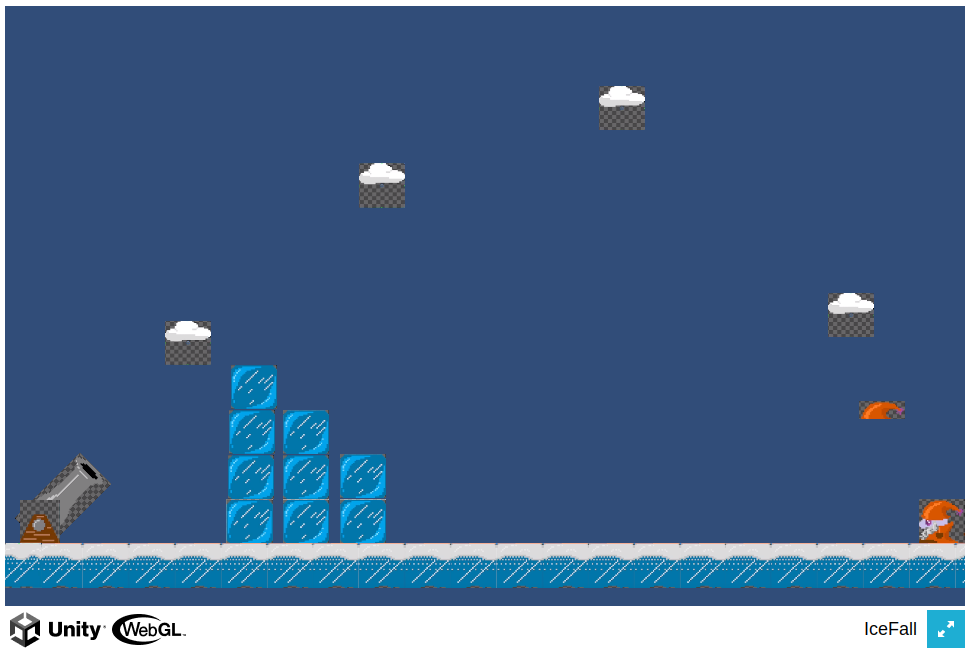

Hack-A-Day is a project I'm doing in November, where I try to make 30 new projects, in 30 days.

# Day 06: Hack-An-Icecube

I tried to copy a [much better unity3d project](https://juzek.itch.io/one-hour-jam-cannon) juzek made for the [zero-hour game jam](https://itch.io/jam/0h-game-jam-2022). This was my first unity project! But, I ran out of time and it was a failure. That said I got unity working (mostly, autocomplete didn't work in VSCode).

Demo available at [here](https://tilde.za3k.com/hackaday/icecube).

Source not available for this one, sorry. Unity projects are hard to move and I couldn't figure it out.
